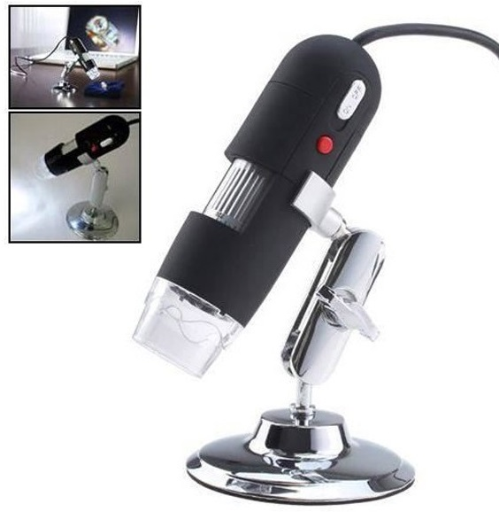

# 1. usb_microscope_capture

Author: N. Papadakis

Repository for a small package used for the development of  a USB Microscope capture  device.

# 2. Requirements

## 2.1. Hardware requirements

This is written and tested for an OEM digital Microscope with 500x zoom (probably other microscopes can use the same architecture). 



## 2.2. Installation 

- clone the repository
- navivate to the repository and to install use the following :
```{bash}
python setup.py install
```
### Camera drivers troubleshooting.

The model I used and testd is based on Genesys Logic UVC Camera controller. This model although supported gave me trouble is some of my development machines (in others no). More Specifically what I encountered was the following:

I have :
- a Lenovo desktop laptop that worked without problems.
- Another desktopworked sometimes and sometimes didn't work. I had obs studio installed, and in some occasions what I saw was that the first image showed the obs studio icon, so I suspect there might be some interplay there, but could not confirm it. 

When  I checked the Windows device manager, I saw that the hardward ID was  `USB\VID_05E3&PID_0510&MI_00`, which corresponds (upon search on the internet) to Lenovo Easy camera. This might explain Why the Lenovo computer worked without problems.

What I ended up doing was to instal the drivers that came with the usb microscope. This solved the problem.Then I change the driversto GL 2.0 UVC camera device (the GenesysLogic Driver). the updated driver Has driver date 3/11/2014 and driver version 14.3.11.0.

The files of the driver as presented in Driver details are:
- system32\Drivers\glavcam.sys
- system32\ksthunk.sys
- sysWOW64\glprop.ax
- sysWOW64\uninstall.dll

# 3. Example code


After installing you can use, the following code in python to capture the data

```{python}
import cv2
import pathlib 
from datetime import datetime
import time 
from usb_microscope_capture import Camera, ImageCapturingExperiment

CAMERA_ID = 1
# Set the resolution of the camera
CAMERA_WIDTH = 640
CAMERA_HEIGHT = 480
DELAY_MS = 500
NUM_IMAGES = 150
IMAGE_DATA_DIR = pathlib.Path('captured_images')
IMAGE_DATA_DIR.mkdir(parents=True, exist_ok=True)

# initialise the camera
camera = Camera(id=CAMERA_ID, width=CAMERA_WIDTH, height=CAMERA_HEIGHT)
experiment = ImageCapturingExperiment(camera, DELAY_MS, NUM_IMAGES, image_folder=IMAGE_DATA_DIR)

# experiment.GRAYSCALE = False ## uncomment the line to save grayscale images


experiment.initialise()

while experiment.image_counter < experiment.num_images:
    
    curr_time_s = time.time()
    if curr_time_s - experiment.last_capture_timestamp >= experiment.delay_ms/1000:
        print (experiment.image_counter)
        frame = experiment.capture_image(curr_time_s)
        
        cv2.imshow('Captured Image', frame)        
    key = cv2.waitKey(1)
    if key == ord("q"):
        break
        

experiment.finalise()
```