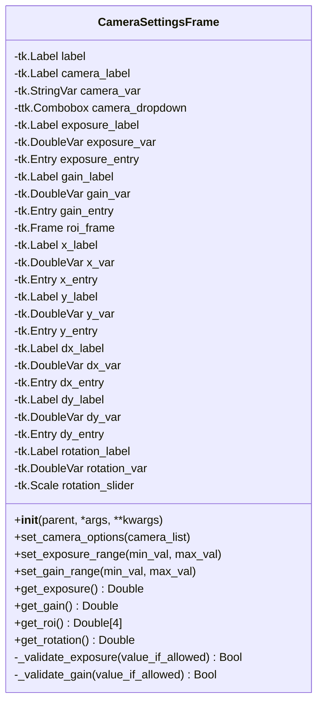

```mermaid
classDiagram
    class CameraSettingsFrame {
        +__init__(parent, *args, **kwargs)
        +set_camera_options(camera_list)
        +set_exposure_range(min_val, max_val)
        +set_gain_range(min_val, max_val)
        +get_exposure() Double
        +get_gain() Double
        +get_roi() Double[4]
        +get_rotation() Double
        -_validate_exposure(value_if_allowed) Bool
        -_validate_gain(value_if_allowed) Bool

        -tk.Label label
        -tk.Label camera_label
        -tk.StringVar camera_var
        -ttk.Combobox camera_dropdown
        -tk.Label exposure_label
        -tk.DoubleVar exposure_var
        -tk.Entry exposure_entry
        -tk.Label gain_label
        -tk.DoubleVar gain_var
        -tk.Entry gain_entry
        -tk.Frame roi_frame
        -tk.Label x_label
        -tk.DoubleVar x_var
        -tk.Entry x_entry
        -tk.Label y_label
        -tk.DoubleVar y_var
        -tk.Entry y_entry
        -tk.Label dx_label
        -tk.DoubleVar dx_var
        -tk.Entry dx_entry
        -tk.Label dy_label
        -tk.DoubleVar dy_var
        -tk.Entry dy_entry
        -tk.Label rotation_label
        -tk.DoubleVar rotation_var
        -tk.Scale rotation_slider
    }

```